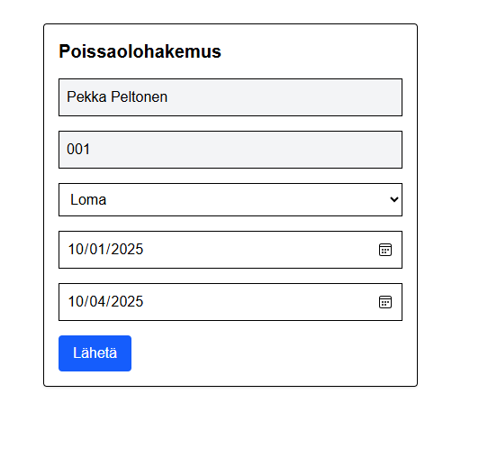

# Poissaolosovellus

Tämä on Reactilla ja Tailwind CSS:llä rakennettu poissaolosovellus, jossa käyttäjät voivat kirjautua sisään, tarkastella poissaoloja, lähettää poissaolohakemuksia ja tarkastella omia poissaoloja kalenterinäkymässä. Jos poissaolohakemuksen syy on saldovapaa tai loma, lomake menee esihenkilölle hyväksyttäväksi. Esihenkilö näkee kaikkien omien tiimiläisten poissaolot samassa kalenterissa.

Frontend lähettää pyyntöjä backendille, backend tallentaa poissaolot tietokantaan ja palauttaa tiedot takaisin frontendille, joka näyttää ne käyttäjälle.

## Ominaisuudet / Frontend

- 🔐 **Kirjautuminen** 

  - Käyttäjät tunnistetaan käyttäjätunnuksen ja salasanan perusteella.
  - Käyttäjätiedot haetaan staattisesta `users.ts`-tiedostosta.
  - Kirjautumisen jälkeen käyttäjä ohjataan roolinsa mukaiseen näkymään.

- 🧑‍💼 **Roolipohjaiset näkymät**
  - **Työntekijä** ohjataan `/EmployeeHome`-näkymään, jossa näkyvät omat poissaolot ja painikkeet lomakkeen lähetykseen ja kalenteriin.
  
  - **Esihenkilö** ohjataan `/ManagerView`-näkymään, jossa näkyvät tiimin poissaolot ryhmiteltynä tilan mukaan.
  

  users.ts sisältää:
    🧑‍💼id
    🧑‍💼etunimi
    🧑‍💼sukunimi
    🧑‍💼kayttajatunnus
    🧑‍💼salasana
    🧑‍💼rooli
    🧑‍💼esihenkiloId

- 📅 **Kalenterinäkymä** (`/TeamCalendar`)

  - Näyttää poissaolot joko viikko tai kuukausinäkymässä
  - Värikoodaus eri poissaolosyille (loma, saldovapaa, työmatka, muu).
  - Navigointipainikkeet: edellinen, nykyinen, seuraava, viikko/kuukausinäkymä.
  - Käytettävissä molemmille rooleille. Esihenkilö-roolilla näkee koko tiimin poissaolot, työntekijä-roolilla näkee omat poissaolot.

- 📝 **Poissaolohakemuslomake** (`/AbsenceForm`)

  - Käyttäjä voi lähettää uuden poissaolohakemuksen.
  - Lomake tarkistaa pakolliset kentät ja päivämäärien oikeellisuude, päällekkäisiä päivämääriä ei sallita.
  - Jos poissaolon syy on saldovapaa tai loma, lomake menee esihenkilölle hyväksyttäväksi. Esihenkilö määritellään users-tiedostossa.

- 🔄 **Navigointi**
  - Jokaisella sivulla on sidebar, josta pääsee siirtymään etusivulle, kalenterinäkymään sekä kirjautumaan ulos.

## Teknologiat

- ⚛️ React
- 💨 Tailwind CSS
- 🗂️ localStorage käyttäjätietojen tallentamiseen
- 🧭 react-router-dom reititykseen
- 📦 Vite kehitysympäristönä

## Komponentit 

| Komponentti           | Näkymä               | Rooli         |
|-----------------------|----------------------|---------------|
| `/AbsenceForm`        | Poissaolohakemus     | Molemmat      |
| `/AppLayout`          | Alareunan kuva       | Molemmat      |
| `/EmployeeHome`       | Työntekijän etusivu  | Työntekijä    |
| `/Header`             | Yläotsikko           | Molemmat      |
| `/Login`              | Kirjautuminen        | Molemmat      |
| `/ManagerView`        | Esihenkilön etusivu  | Esihenkilö    |
| `/PublicLayout`       | Poissaolohakemus     | Molemmat      |
| `/sidebar`            | Sivupalkki           | Molemmat      |
| `/TeamCalendar`       | Kalenterinäkymä      | Molemmat      |

### BACKEND

🗄️ Tietokanta (Prisma + SQLite)

Käytössä Prisma ORM (työkalu, jolla voit työskennellä tietokantojen kanssa ilman, että kirjoitat suoraan SQL-kyselyitä) SQLite-tietokannan kanssa.
schema.prisma määrittelee Absence-mallin:
Jokaisella poissaololla (Absence) on:
    id (UUID, automaattisesti luotu)
    employeeName
    employeeId
    startDate 
    endDate
    reason (loma, saldovapaa, työmatka, muu)
    status (odottaa, hyväksytty, hylätty, palautettu)
    esihenkiloId (asetetaan automaattisesti työntekijän datasta)
    esihenkiloNimi
    approvedDate
    createdAt (lisäyksen aikaleima)

Palvelin pyörii portissa 3001 ja kaikki reitit alkavat /api.

1. POST /api/absences → createAbsence

Luo uuden poissaolon.
Tarkistaa, että kaikki pakolliset kentät (employeeName, employeeId, startDate, endDate, reason) on annettu.
Validioi päivämäärät.
Statuksen määritys:

    Jos syy = loma tai saldovapaa → odottaa
    Muuten → hyväksytty

Hakee users.ts-tiedostosta työntekijän ja lisää automaattisesti hänen esihenkiloId:n.
Tallentaa poissaolon tietokantaan.

➡️ Vastaa 201 Created ja palauttaa uuden poissaolon JSON-muodossa.

2. GET /api/absences → getAbsences

Hakee kaikki poissaolot tietokannasta.
Järjestää ne createdAt-kentän mukaan (uusin ensin).
Palauttaa listan JSONina.

3. PATCH /api/absences/:id → updateAbsenceStatus

Päivittää olemassa olevan poissaolon tilan.
Saa status-kentän bodysta, esim.:
{ "status": "hyväksytty" }
Käyttää normalize()-funktiota ääkkösten/välilyöntien varalta, jotta esim. "hyvaksytty" toimii.
Sallittuja tiloja ovat:
    hyväksytty
    hylätty
    palautettu

Jos id:tä ei löydy, palauttaa 404.
Jos status ei kelpaa, palauttaa 400.
Muuten palauttaa 200 OK ja päivitetyn poissaolon.

4. GET / (juuri)

Testireitti, joka palauttaa "Poissaolosovellus käynnissä!".

5. PATCH /api/_test

Testireitti, joka vain tulostaa bodyn serverilogiikkaan.

Hyödyllinen debuggaamiseen.

🧭 Kokonaiskuva

Frontend (React/Vite) pyytää dataa http://localhost:3001/api/absences jne.
Backend vastaa näihin pyyntöihin:
Tallentaa ja hakee poissaolot (Prisman kautta SQLiteen).
Päivittää poissaolon tilan.
Käyttäjien ja esihenkilöiden väliset suhteet haetaan staattisesta users.ts-tiedostosta (ei vielä tietokannasta).

👉 Käytännössä siis backend on kevyt REST API, jossa on vain yksi resurssi: Absence.
Frontend hoitaa kirjautumisen ja roolit, mutta backend hallinnoi poissaolojen toimintoja.

##### KÄYNNISTYS

1. Asenna riippuvuudet: npm install (backend + frontend)
2. Asenna prisma: npx prisma generate
3. Käynnistä ensin backend npm run dev ja sitten frontend npm run dev
  

## Huomioita

- Käyttäjätiedot ovat kovakoodattuna `users.ts`-tiedostossa.
- Poissaolot haetaan backendistä reitiltä `http://localhost:3001/api/absences`.
- Sovellus ei sisällä kirjautumisen suojausta (esim. tokenit), vaan toimii demotarkoituksessa.

### Frontend lähettää pyyntöjä backendille, backend tallentaa poissaolot tietokantaan ja palauttaa tiedot takaisin frontendille, joka näyttää ne käyttäjälle

### Tietoturva-analyysi ja poikkeamat:

1. Ei autentikointia API-päätteissä
Backend-reitit (/api/absences) ovat täysin avoimia
Kuka tahansa voi hakea, luoda tai muokata poissaoloja
Ei JWT-tokeneja, sessiovalidointia tai mitään autentikointia

2. Vain frontend-puolen valtuutus
Kaikki käyttöoikeustarkistukset tehdään vain frontendissä localStorage:n avulla
Käyttäjät voivat ohittaa roolirajoitukset kutsumalla API:a suoraan
ManagerView.tsx:n roolintarkistus estää vain UI:n näyttämisen, ei datan käsittelyä

3. Turvaton sessioiden hallinta
Käyttäjätiedot tallennetaan localStorage:iin (ei turvallista)
Ei session timeout:ia tai uudelleenvalidointia
Ei turvallisia session-tokeneja

4. Kovakoodattu käyttäjätietokanta
Salasanat tallennettu selkotekstinä ("pekka123", "maija123")
Ei salasanojen hashausta
Käyttäjätiedot frontend-koodissa näkyvissä

5. Puuttuva pääsynhallinta API:ssa
GET /api/absences palauttaa KAIKKI poissaolot kenelle tahansa
POST /api/absences sallii kenen tahansa luoda poissaoloja kenelle tahansa
PATCH /api/absences/:id sallii tilan päivitykset ilman esihenkilön varmistusta

6. Datan paljastuminen
Frontend hakee kaikki poissaolot ja suodattaa ne vasta sen jälkeen
Arkaluontoinen työntekijädata näkyy luvattomille käyttäjille

7. Korjausehdotukset:
Koodin tulisi toteuttaa:
- Backend-autentikointi middleware
- JWT-pohjainen sessioiden hallinta
- Salasanojen hashays
- Roolipohjainen pääsynhallinta API-päätteissä
- Server-puolen datasuodatus
- Turvallisten HTTP-only cookiejen käyttö localStorage:n sijaan

# Playwright Testien Yhteenveto

|---------------------------------------------------------------------------------------------------------------------------------------| 
| Testi / Tiedosto           | Testauksen kohde            | Mitä testataan                                                 |Tila       |
|----------------------------|-----------------------------|----------------------------------------------------------------|-----------|
|                            |                             |- Poissaolohakemus-nappi                                        |✅     
|                            |                             |- Poissaololista renderöityy                                    |✅
|                            |                             |- Väripallot näkyvät oikein                                     |✅
|                            |                             |- Käytetyt päivät yhteenveto                                    |✅
|                            |                             |- Tyhjä lista näyttää "Ei poissaoloja"                          |✅
|                            |                             |- GET /api/absences epäonnistuminen näyttää virheilmoituksen    |✅
|---------------------------------------------------------------------------------------------------------------------------------------| 
| **Form**                   |Poissaolohakemuslomake       |- Lomakkeen kenttien syöttö                                     |✅
|                            |                             |- Lähetä-napin toiminta                                         |✅
|                            |                             |- Alert-viesti poissaolohakemuksen lähetyksestä                 |✅
|---------------------------------------------------------------------------------------------------------------------------------------| 
| **ManagerView**            |Esihenkilönäkymä             |- Odottavat poissaolot näkyvät                                  |✅
|                            |                             |- Hyväksy-painikkeen toiminta                                   |✅
|                            |                             |- Hyväksyttyjen listalle siirtyminen onnistuu                   |✅
|---------------------------------------------------------------------------------------------------------------------------------------| 
| **RoleAccess**             |Roolipohjainen ohjaus        |- Työntekijä ohjautuu EmployeeHome-näkymään                     |✅
|                            |                             |- Esihenkilö ohjautuu ManagerView-näkymään                      |✅
|                            |                             |- Työntekijä ei pääse ManagerView-näkymään, virheilmoitus näkyy |✅
|---------------------------------------------------------------------------------------------------------------------------------------| 
| **TeamCalendar**           |Tiimikalenteri               |- Kalenterin renderöinti                                        |✅
|                            |                             |- Kuukausi-/viikkonäkymän vaihto                                |✅
|                            |                             |- Navigointinapit (Edellinen, Nykyinen, Seuraava)               |✅
|                            |                             |- Poissaolot näkyvät tapahtumina                                |✅
|                            |                             |- Värikoodaus toimii                                            |✅
|---------------------------------------------------------------------------------------------------------------------------------------| 

### Testaus omalla havainnoilla.

✅ Kirjauduttu työntekijä-oikeuksin 
✅ Lähetetty poissaolohakemus ajanjaksolle 29.9.-30.9.2025,
koska tässä oli jo päällekkäisyys hyväksytyssä poissaolossa, 
ei sovellus antanut tehdä toista hakemusta samalle ajanjaksolle 
✅ Lähetetty hakemus ajanjaksolle 1.10.2025, jonka sovellus välitti esihenkilölle hyväksyttäväksi,
päällekkäisyyttä ei ollut, joten tämä oli toimiva 
✅ Kirjauduttu esihenkilö-oikeuksin 
✅ Sovelluksessa oli työntekijän hakemus 1.10.2025 ajanjaksolle odottavissa 
✅ Hakemus hyväksytty, jolloin siirtyi Hyväksyttyihin hakemuksiin 
✅ Poissaolotieto siirtyi oikein kalenteri-näkymään esihenkilölle 
✅ Esihenkilöllä näkyy kaikkien työntekijöiden poissaolot kalenterinäkymässä 
✅ Työntekijällä näkyy vain omat hyväksytyt poissaolot kalenterinäkymässä 
✅ Yllä olevia testauksia tehdässä havaittu myös navikoinnin toimivan tarkoituksen mukaisesti 

© 2025 Poissaolosovellus

